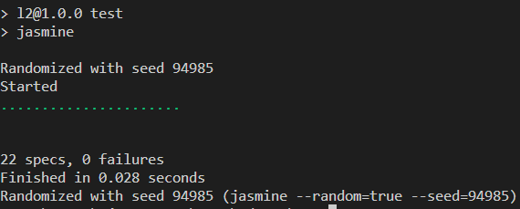

# Testrapport för modulens metoder
|Test av metod|Antal test|Testresultat|
|-------|-----------|------------|
|Fikonsprak.translateToFikonSprak()|3|[länk till test](spec/support/Fikonsprak.spec.js)|
|Fikonsprak.translateFromFikonSprak()|2|[länk till test](spec/support/Fikonsprak.spec.js)|
|Fikonsprak.isFikonSprak()|1|[länk till test](spec/support/Fikonsprak.spec.js)|
|Rovarsprak.translateToRovarSprak()|2|[länk till test](spec/support/Rovarsprak.spec.js)|
|Rovarsprak.translateFromRovarSprak()|1|[länk till test](spec/support/Rovarsprak.spec.js)|
|Rovarsprak.validateTextInput()|1|[länk till test](spec/support/Rovarsprak.spec.js)|
|Rovarsprak.isRovarSprak()|1|[länk till test](spec/support/Rovarsprak.spec.js)|
|Rot13.encodeToROT13()|2|[länk till test](spec/support/Rot13.spec.js)|
|Rot13.decodeFromROT13()|2|[länk till test](spec/support/Rot13.spec.js)|
|StringFunctions.countNumberOfCharacters()|1|[länk till test](spec/support/StringFunctions.spec.js)|
|StringFunctions.countNumberOfWords()|1|[länk till test](spec/support/StringFunctions.spec.js)|
|StringFunctions.countNumberOfVowels()|1|[länk till test](spec/support/StringFunctions.spec.js)|
|StringFunctions.countNumberOfConsonants()|1|[länk till test](spec/support/StringFunctions.spec.js)|
|StringFunctions.isStringEmpty()|1|[länk till test](spec/support/StringFunctions.spec.js)|
|StringFunctions.isString()|1|[länk till test](spec/support/StringFunctions.spec.js)|
|StringFunctions.reverseString()|1|[länk till test](spec/support/StringFunctions.spec.js)|

## Resultat från tester i Jasmine
